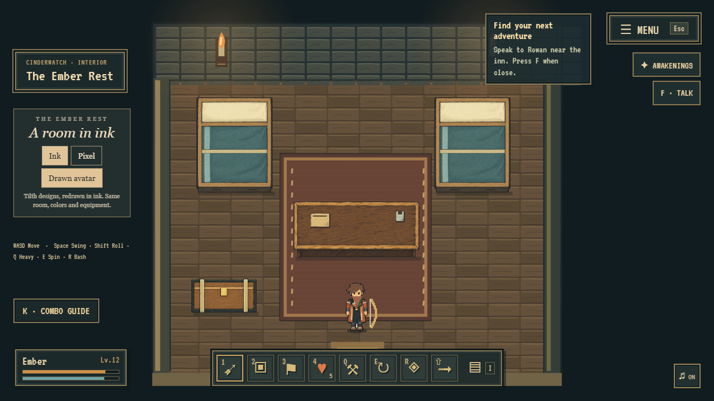

# Playable illustrated inn

10 September 2026. A bounded proof of the [art-port proposal](ART_PORT.md), on `codex/tilth-integration`. The second pass follows Tilth's own designs and palette; it replaces the mismatched Notebook World study furniture and outfit.

## Try it

Run the existing Vite server and open `http://127.0.0.1:5174/?art=ink`. The link enters The Ember Rest through the normal room-entry handler. **Art study** in the village opens the same room. New players still use Tilth's character creator.

- **Ink / Pixel** compares the same room at the same player position.
- Hold WASD/arrows to walk continuously in the inn and around its furniture.
- **Drawn avatar / Saved avatar** compares the covered appearance with its pixel rendering. Other editor appearances automatically retain their saved pixel rendering.
- Existing weapon actions, combos, quests and the bottom doorway remain available.

## Corrected camera and designs

References were captured from `interiors.js` and `volcanic.js`, using the actual furnishing data and the saved Ember appearance. Assets retain the straight rectangular bed, cream pillow, teal blanket and ochre band; the brown table with parchment and sage cup; and the wooden chest with brass straps and latch. The character retains brown Swept hair, a copper Coat, dark underclothes and brown boots. These are illustrative interpretations of the source designs, not a claim of pixel-exact geometry or color reproduction by the generator.

All furniture now draws at its original `x`, `y`, `w`, `h`. The previous height offsets and front-facing desk/cupboard substitutions are removed. The table has equal horizontal front/back edges, screen-vertical depth edges and a shallow underside, instead of a trapezoid with long foreground legs. Floorboards, rug, walls, doorway and candles retain Tilth's original construction and palette. The room shell uses cached Canvas linework.

The table and character use the first generated drawings selected by Hayden. Later regeneration attempts were rejected. Hayden explicitly authorized programmatic checkerboard removal: the preparation script changes alpha only and preserves source RGB. Original inputs, generation prompts, hashes and light/dark cutout QA are retained under `docs/art/`.

## Runtime boundary

Four prepared PNGs load once on study request or inn entry; ordinary village startup does not fetch them. PNG alpha checks and sprite-cell bounds are computed on load. The 8-column, 4-row character atlas contains six walking cells and two settling/idle cells per direction. Every cell uses a shared scale and registered origin instead of stretching each pose independently. These are not yet a complete set of intermediate directional turns or drawn combat poses.

Tilth still owns collisions, movement, transitions, profiles, the event ledger, quests, generation queue, effects and sound. A real inn entry may advance an accepted visit objective. Presentation changes do not create gameplay events. Art drawing and movement require no image generation call. Asset failures keep the original pixel room available. Actor/prop ordering still uses ground position, while collision continues to prevent walking through furniture.

The full-avatar sheet only covers Swept hair `#705039`, skin `#e4b47e`, Coat `#a85b37`. A different name or weapon works with the same drawn body. Changing any uncovered appearance field automatically restores the actual saved pixel character, including in dialogue. Restoring the covered choices restores the drawn option. Custom attachments and weapon animations still come from Tilth.

See [customizable character art](CHARACTER_ART.md) for the proposed registered layers, color masks, per-direction draw order and editor integration. The current complete-character atlas is an appearance proof, not that modular system.

## Validation

- All 46 tests pass, including unchanged game rules, exact illustration footprint registration, actor/prop ordering, bounded continuous movement against actual furnishing data, prepared frame selection and editor fallback rules.
- Modern unminified Vite build passes using `node node_modules/vite/bin/vite.js build --configLoader native --minify false --target esnext` on this Windows host.
- Browser inspection at 1280 by 720 covers the original/drawn room comparison, alpha edges, continuous movement around furniture and behind the table, hairstyle and hair-color edits, and restoring the drawn appearance. Four art files loaded and no page errors occurred. This isolated visual check disabled model requests.
- The first proof previously verified a recognized bow combo, first-visit dialogue and the normal exit into the village with the live runtime.

No frame-rate or network-latency benchmark is claimed. Shipping-size optimization, full directional turning, drawn attack poses, modular customization, NPCs, other locations and mobile layout polish remain outside this proof.
